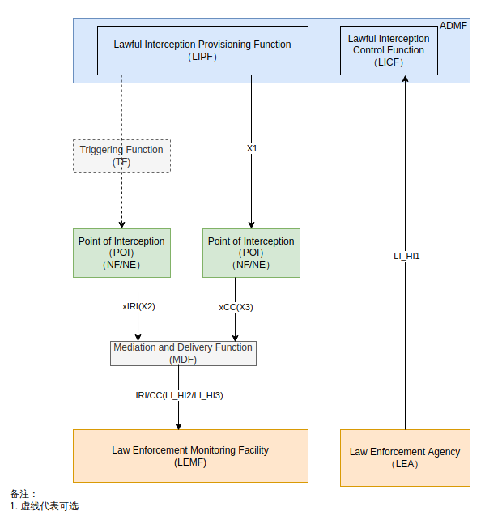
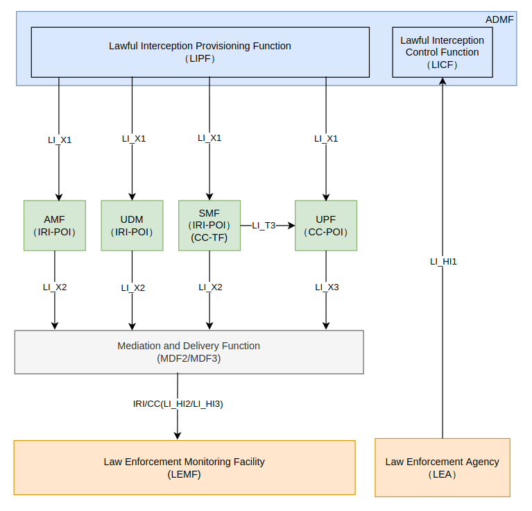
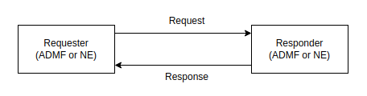
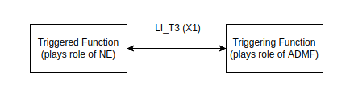
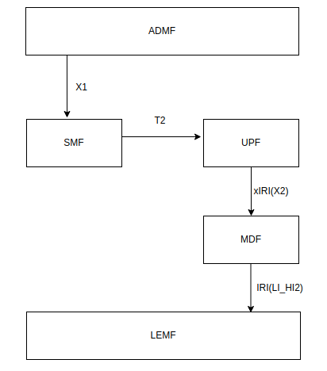

# 核心网合法监听（一）

参考文档说明：

- TS33127 clause 6.2 描述各个网元（根据X1指令）的监听消息类型（如AMF的Registration消息、SMF的pDUSessionModification消息等）
- TS33128 clause 6.2 描述各个网元接收的X1消息格式及应产生的X2或X3消息格式
- ETSI TS103 280 描述LI接口的公共参数及参数校验规则
- ETSI TS102 221-1 描述X1消息
- ETSI TS102 221-2 描述X2/3消息
- TS_103_28_v020701.xsd 通用xs类型解释
- TS_103_221_-1_v010601.xsd X1协议专有xs类型解释

本文将简单描述5G核心网的合法监听，后续将讲解合法监听X1和X2/X3消息的构造及编码

## 一、 什么是合法监听？

合法监听是政府强制要求的，运营商需要提供一套接口给有关部门调用，以监听用户的行为。合法监听在核心网层面涉及到X1/2/3，T2/3接口，

## 二、 合法监听在核心网里面涉及到什么内容？



ADMF: Administration Function, 提供CSP的合法监听的管理功能

TF: 由LIPF提供，负责触发POI，发送拦截规则、转发规则、目标标识和相关信息（给POI）

POI(NF/NE): 合法监听功能的实施者，负责按ADMF的要求采集数据，并通过X2/3接口发送给LEMF，有两种类型，一种是IRI-POI，产生xIRI（Intercept Related Information）消息通过X2接口发给MDF2；一种是CC-POI，产生xCC（Content of Communication）消息通过X3接口发给MDF3

MDF:  调解和交付功能，执行必要的翻译、关联和调解，通过HI2和HI3接口将材料（IRI/CC）移交给LEMF，这部分功能可直接由NF/NE实现

LI在核心网的具体架构：



### 核心网需要关注的流程（举例）

**Intercept-Related Information (IRI) from 5GC NFs**

Intercept-related information also referred to as **Events** are triggered by activities detected at the Network Function and provided to the LI. The IRI Event are generated based on **SUCI** or **PEI** or **GPSI** (Generic Public Subscription Identifier) Identities.

- IRI Event applicable to the AMF are:
  - Registration
  - Deregistration
  - Location update
  - Start of interception with already registered UE.
  - Unsuccessful communication attempt.
- IRI Event applicable to SMF/UPF include:
  - PDU Session establishment
  - PDU Session modification
  - PDU Session release
  - Start of interception with an established PDU Session

Using above information Target identity, **Time stamp**, Correlation information, **Location information**, Session related information is provided to Law Enforcement Facility via **MDF** function.

## 三、X1接口及通信模型



### a. 消息传递

NE或者ADMF都可能主动发起请求，大多数情况都是ADMF主动发起Request，少数情况NE会发起Request用于传递fault reports等消息.

**消息容器**：RequestContainer、ResponseContainer

一个容器内的所有消息是同一时间（没有先后顺序）交付的（从同一个Requester到同一个Responder或从同一个Responder到同一个Requester）

**注意**：只有一个request或response消息也可以container内传送


### b. 时间要求及行为

Requester发送请求消息给Responder，要求Responder在TIME1时间内返回Response，TIME1通常可配置，默认为5s，Requester会等待TIME2时间，TIME2时间通常可配置，至少是2倍的TIME1，默认为15s

若在TIME1时间内，Responder没有处理完Task或者Task处理失败，则返回OK - Acknowledged，一旦action完成或者Task失败，Responder（通常是NE）要主动发status report给对方，使用相同的XID或者DID，但这条消息拥有自己的X1TrancationID（由报告方生成）

**注意**：OK-Acknowledged消息只能用于Task的Activating、Modifying、Deleting或者其他Task，对于通过“RequestContainer”传输的请求收到的每个“OK - Acknowledged”响应，请求者（通常是ADMF）应实施逻辑以确保收到相关状态报告（通常来自NE）并完成交易或启动恢复程序（向NE发起新的Activating或Modifying或Deleting等请求）。

若在TIME2时间内，Requester没有收到Responder的Response，或者没有收到NE的status report（OK-Acknowledge），Requester将假设Request发送失败或者Response接收失败。此时Requester可以考虑两种做法：1. 请求上个Task的XID的status，考虑是否需要ActivateTask、ModifyTask、DeactivateTask、DeactivateAllTasks；2. Requester考虑Re-send the Task（用新的Request以及新的X1TransactionID）


### c. 告警和错误(fault)(TS103 221-1 clause 5.3)

（1）告警是一次性问题，即由NE发给ADMF，然后不再占用X1接口。告警不用于影响流量的issue（例如丢失content或者intercept-related-related信息）。例如资源即将耗尽（该消息不能影响流量）、证书/密钥即将到期等情况

**注意**：告警需要使用issue-reporting messages类型的消息而不能用Status-Getting messages。出于审查原因，NE需要记录所有的告警

（2）fault：NE发现问题并且尝试管理或纠正该问题，例如，流量丢失的问题被归类为fault


## 四、X1消息

### 4.1 Basic Message

|       Field       |                         Description                          |                            Format                            | M/O/C |
| :---------------: | :----------------------------------------------------------: | :----------------------------------------------------------: | :---: |
|  ADMF Identifier  | 对NE的唯一标识符 ,Required to match the details provided Recommendation [3]，the ADMF's X.509 certificate (see clause 8) |                           xs:token                           |   M   |
|   NE Identifier   | 对ADMF的唯一标识符，equired to match the details provided Recommendation [3]，the ADMF's X.509 certificate (see clause 8) |                           xs:token                           |   M   |
| Message Timestamp |                指示Requester发送该消息的time                 | QualifiedMicrosecondDateTime <br> xs:dateTime <br> 2017-10-06T18:46:21.247432Z |   M   |
|      Version      |                 用于编码时标识协议文档的版本                 |                            v1.7.1                            |   M   |
| X1 TranscationID  |                  用于关联Request和Response                   |                            UUIDv4                            |   C   |

### 4.2 Message Type

#### 4.2.1 Task Control：

- **ActivateTask**
- ModifyTask
- **DeactivateTask**
- DeactivateAllTasks

#### 4.2.2 Destination Control：

- **CreateDestination**
- ModifyDestination
- **RemoveDestination**
- RemoveAllDestinations

#### 4.2.3 Getting Information from NE：

- **GetTaskDetails**
- **GetDestinationDetails**
- GetNEStatus
- GetAllDetails
- **ListAllDetails**

#### 4.2.4 Reporting issues from the NE

- ReportTaskIssue on given XID
- ReportDestinationIssue on given DID
- ReportNEIssue

#### 4.2.5 **Pings and Keepalives**

- Ping
- Keepalive

### 4.3 Message Definitions: task control

**Direction**: ADMF to NE

**Request**: 

|    Field    |  Description   | Format | M/C/O |
| :---------: | :------------: | :----: | :---: |
| TaskDetails | 目标和监听细节 | 见下表 |   M   |

|            Field            |                         Description                          |                           Format                           | M/C/O |
| :-------------------------: | :----------------------------------------------------------: | :--------------------------------------------------------: | :---: |
|             XID             |                        任务的唯一标识                        |                           UUIDv4                           |   M   |
|      TargetIdentifiers      | 标识要拦截的流量，如果存在多个标准，则需要匹配所有标准。如果 NE 不能根据指定的标准进行定位（例如，由于不支持的格式或标识符的不适当组合），则 NE 应以适当的错误拒绝该请求 |                           见下表                           |   M   |
|        DeliveryType         |              标识数据交付的时候是用X2还是X3接口              | Enumerated value - one of "X2Only","X3Only" and "X2andX3". |   M   |
|         ListOfDIDs          |   数据交付的目的地ID（DID），可以指定多个DID（如果NE支持）   |                                                            |   M   |
|   ListOfMediationDetails    |                                                              |                                                            |   C   |
|        CorrelationID        | 分配给此任务的截获材料的相关标识符。 用于触发场景，非中介功能网元应忽略。 |                      Unsigned integer                      |   O   |
| ImplicitDeactivationAllowed | 指示当Task已经完成的时候，NE可以自动deactivate该Task，当Task被NE自动deactivate的时候，NE需要报告合适的TaskReportType的ReportTaskIssue消息 |                          Boolean                           |   O   |
|          ProductID          | 提供时，接收实体应根据ETSI TS 103 221-2 clause5.2.7节使用它来填充X2/X3 XID报头，而不是任务的XID。如果未提供，则应使用任务的XID |                           UUIDv4                           |   O   |
|    TaskDetailsExtensions    |                   拓展占位符（一个或多个）                   |                                                            |   O   |

**注意**：If a Task has an invalid combination of DeliveryType and Destinations (e.g. "X2andX3" delivery specified, but only an X2 Destination given), then the NE shall reject the ActivateTaskRequest with an appropriate error.

表 TargetIdentifier Formats:（不全）

|     Field     | Description | Format | M/C/O |
| :-----------: | :---------: | :----: | :---: |
|     IMSI      |             |        |       |
|     IMEI      |             |        |       |
|  MAC Address  |             |        |       |
| IPv4 Address  |             |        |       |
| IPv6 Address  |             |        |       |
|   TCP Port    |             |        |       |
|   UDP Port    |             |        |       |
| TCP PortRange |             |        |       |
| UDP PortRange |             |        |       |
| EmailAddress  |             |        |       |
|     IMPU      |             |        |       |
|     IMPI      |             |        |       |
|      NAI      |             |        |       |
| GTPUTunnelId  |             |        |       |
| GTPCTunnelId  |             |        |       |
|   SUPIIMSI    |             |        |       |
|    SUPINAI    |             |        |       |
|     SUCI      |             |        |       |

**Response**: 

|    Field    | Description | Format | M/C/O |
| :---------: | :---------: | :----: | :---: |
| OK or Error |             |        |   M   |

一般来说，AMF比较简单，只需要XID、Targetdentifiers、DeliveryType、ListOfDIDs、TaskDetailsExtensions(IdentifierAssociationExtensions)

详情见TS33128 clause 6.2.2


### 4.4 Message Definitions: destination control

**Direction**: ADMF to NE

**Request**: 

|        Field        |  Description   | Format | M/C/O |
| :-----------------: | :------------: | :----: | :---: |
| Destination details | 新目的地的详情 |        |   M   |

|            Field             |            Description             |                            Format                            | M/C/O |
| :--------------------------: | :--------------------------------: | :----------------------------------------------------------: | :---: |
|             DID              |                                    |                            UUIDv4                            |   M   |
|         FriendlyName         |                                    |                            string                            |   O   |
|         DeliveryType         | 标识数据交付的时候是用X2还是X3接口 | Enumerated value - one of "X2Only", "X3Only" and "X2andX3"，X2Only和X3Only最常用 |   M   |
|       DeliveryAddress        |              交付地址              |                            见下表                            |   M   |
| DestinationDetailsExtensions |      拓展占位符（一个或多个）      |                                                              |   O   |

| Field            | Description                             | Format |
| ---------------- | --------------------------------------- | ------ |
| IPAddressAndPort | 需支持IPv4/IPv6，只能包含一个地址和端口 |        |
| E164Number       | E.164 目的地                            |        |
| URI              | 如FQDN或者其他形式的URI                 |        |
| EmailAddress     | Email 地址                              |        |

**Response**: 

|    Field    | Description | Format | M/C/O |
| :---------: | :---------: | :----: | :---: |
| OK or Error |             |        |   M   |

### 4.5 Message Definitions: getting information from NE


### 4.6 Message Definitions: reporting issues from the NE


### 4.7 Message Definitions: Pings and Keepalives


### 4.8 X1 Error Response Message

|       Field        |       Description       |                            Format                            | M/C/O |
| :----------------: | :---------------------: | :----------------------------------------------------------: | :---: |
| RequestMessageType | 指示对应的是哪个Request | One of the following: "ActivateTask",<br/>"ModifyTask", "DeactivateTask",<br/>"DeactivateAllTasks", "GetTaskDetails",<br/>"CreateDestination", "ModifyDestination",<br/>"RemoveDestination",<br/>"RemoveAllDestinations",<br/>"GetDestinationDetails", "GetNEStatus",<br/>"GetAllDetails", "ListAllDetails",<br/>"ReportTaskIssue", "ReportDestinationIssue",<br/>"ReportNEIssue", "Ping", "Keepalive" |   M   |
|  ErrorInformation  | 错误码及可选的错误描述  |                            见下表                            |   M   |

|      Field       |                         Description                          |    Format    | M/C/O |
| :--------------: | :----------------------------------------------------------: | :----------: | :---: |
|    ErrorCode     |  标识哪种类型的错误，见ETSI TS103221-1 caluse 6.7, Table 46  |   Integer    |   M   |
| ErrorDescription | Free text field giving further details of the error. Implementers are<br/>encouraged to avoid placing sensitive information (such as personally<br/>identifiably information or sensitive details of the network) in error<br/>messages. | UTF-8 string |   C   |

### 4.9 一个基本的x1消息流程

从本章的c节部分对task消息的定义描述看，一个task在被activate的时候会指定destination的id列表，也就是ListOfDIDs，而DID是uuid标识，不是目标机器的ip或者域名，NE这个时候是无法把生成的xIRI或xCC消息发给指定的目标的。

x1协议还定义了一种消息类型叫destination control，本章的d节部分是对destination的描述，destination支持ip地址、email等方式指定目标机器。

所以，在activate一个task之前，需要先create一个destination，告诉NE所有可能接收x2/3消息的目标的ID和真实地址，NE回复一个resp，然后才对NE下达具体的监听任务，指定需要交付的目标的id，NE回复一个resp。这样，一个最基本的X1消息流程就完成了

### 4.10 X1消息传输方式

使用HTTPS进行传输。其中，HTTPS使用基于HTTP+TLS的方案，HTTP需使用HTTP1.1或HTTP2

**注意：**

HTTP 状态码仅用于表示HTTP层的传输结果，不作为X1的Error Message的结果，所以无论X1消息内容如何，HTTP Status 都应该为200 OK

## 五、LI_T2/3接口

LI_T2/3适用于Triggering deployment model，即触发器模型，如下所示



LI_T2/3接口同样使用X1消息进行通信。因为一些数据的产生是需要条件触发的，例如当SMF检测到UE建立了一条PDU session的时候，SMF需要触发UPF进行该UE的合法监听（When the CC-TF in the SMF detects that a PDU session is being established for a target UE (i.e. when the SMF sends the N4: Session Establishment Request), it shall send an activation message to the CC-POI in the UPF over the LI_T3 interface. ）

**如何确定使用T2还是T3接口？**

首先，LEA不要求监听通信内容，但可能要求需要用户面数据包的IRI消息（这些消息必须从用户面数据包中导出）

To support the generation of related xIRI (i.e. that requires access to the user plane packets), the present document supports two implementation approaches:（TS33127-h20 clause 7.12.2.3）
- In approach 1, xIRI (that includes the correlation number and the target identity) is generated by the IRI-POI in the UP Entity. The IRI-POI generates the xIRI from the user plane packets and sends it to the MDF2. The MDF2 generates the IRI messages and sends them to the LEMF.



- In approach 2, xCC is generated by the CC-POI in the UP Entity as if the warrant involves the interception of communication contents. To enable this, the CC-POI is presumed to be present and provisioned in the UP Entity even when the warrant does not require the interception of communication contents. The CC-POI generates the xCC and sends it to the MDF3. The MDF3 (based on the provisioned intercept information) does not generate and deliver the CC to the LEMF. Instead, the MDF3 forwards the xCC to the MDF2 over LI_MDF interface. The MDF2 then generates the IRI messages from xCC and delivers those IRI messages to the LEMF.


In 5GS and CUPS EPS, the POI in the UP Entity requires a trigger to enable it to detect the user plane packets. The corresponding Triggering Function (IRI-TF or CC-TF) resides in the CP Entity that has the IRI-POI for the generation of other xIRI. The trigger sent by the IRI-TF or CC-TF to the corresponding POI includes the following:

- User plane packet detection rules.
- Target identity.
- Correlation information.
- MDF2 (in approach 1) or MDF3 (in approach 2) address.

这两种方式都可以产生xIRI消息，如果是approach1，则使用LI_T2接口；如果是approach2，则使用LI_T3接口。

SMF使用T2或T3接口的详情见TS33128 caluse 6.2.3.3及TS33128 caluse 6.2.3.4

UPF的生成xCC及xIRI消息的详情见TS33128 caluse 6.2.3.5及TS33128 caluse 6.2.3.6

## 六、X2/3消息

5G核心网基本事件：

|         AMF（TS33128 clause）          |          SMF（TS33128 clause6.2.3.2）           |  UDM（TS33128 clause）  | UPF（TS33128 clause） |
| :------------------------------------: | :---------------------------------------------: | :---------------------: | :-------------------: |
|            AMFRegistration             |           SMFPDUSessionEstablishment            | UDMServingSystemMessage |    PDHeaderReport     |
|           AMFDeregistration            |            SMFPDUSessionModification            |                         |    PDSummaryReport    |
|           AMFLocationUpdate            |              SMFPDUSessionRelease               |                         |                       |
| AMFStartOfInterceptionWithRegisteredUE | SMFStartOfInterceptionWithEstablishedPDUSession |                         |                       |
|        AMFUnsuccessfulProcedure        |            SMFUnsuccessfulProcedure             |                         |                       |
|                                        |                                                 |                         |                       |

条件事件（不全）：

|           AMF            |               SMF                |               UDM                | UPF  |
| :----------------------: | :------------------------------: | :------------------------------: | :--: |
| AMFIdentifierAssociation |   SMFMAPDUSessionEstablishment   | UDMSubscriberRecordChangeMessage |      |
|                          |   SMFMAPDUSessionModification    |     UDMCancelLocationMessage     |      |
|                          |      SMFMAPDUSessionRelease      |                                  |      |
|                          |    SMFMAUnsuccessfulProcedure    |                                  |      |
|                          | SMFPDUtoMAPDUSessionModification |                                  |      |

xIRI消息的更多详情可以查阅3GPP TS33128协议Annex A章节ASN.1描述及ETSI TS103221-2文档


## 附录 A - X1消息实例

```xml
<?xml version="1.0" ?>
<ns1:X1Request xmlns:ns1="http://uri.etsi.org/03221/X1/2017/10" xmlns:xsi="http://www.w3.org/2001/XMLSchema-instance">
  <ns1:x1RequestMessage xsi:type="ns1:ActivateTaskRequest">
    <ns1:admfIdentifier>admfID</ns1:admfIdentifier>
    <ns1:neIdentifier>neID</ns1:neIdentifier>
    <ns1:messageTimestamp>2017-10-06T18:46:21.247432Z</ns1:messageTimestamp>
    <ns1:version>v1.6.1</ns1:version>
    <ns1:x1TransactionId>3741800e-971b-4aa9-85f4-466d2b1adc7f</ns1:x1TransactionId>
    <ns1:taskDetails>
      <ns1:xId>29f28e1c-f230-486a-a860-f5a784ab9172</ns1:xId>
      <ns1:targetIdentifiers>
        <ns1:targetIdentifier>
          <ns1:e164Number>447700900000</ns1:e164Number>
        </ns1:targetIdentifier>
      </ns1:targetIdentifiers>
      <ns1:deliveryType>X2andX3</ns1:deliveryType>
      <ns1:listOfDIDs>
        <ns1:dId>19867c20-8c94-473e-b9cd-8b72b7b05fd4</ns1:dId>
      </ns1:listOfDIDs>
    </ns1:taskDetails>
  </ns1:x1RequestMessage>
</ns1:X1Request>
```

